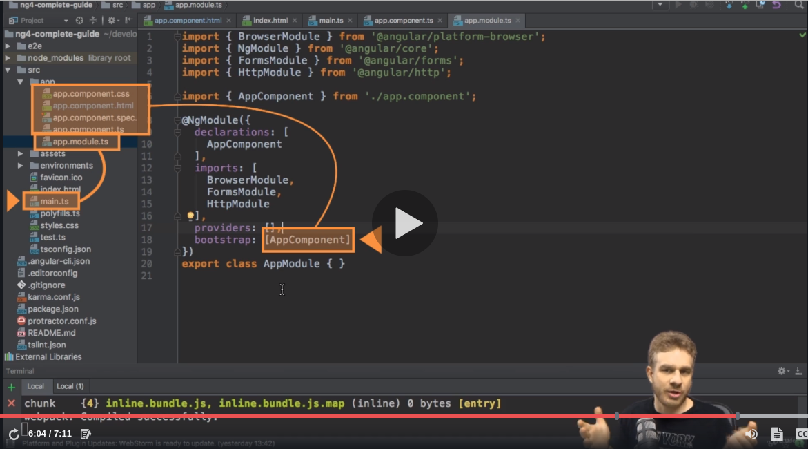

# Angular---The-Complete-Guide-2020-Edition-

Master Angular 9 (formerly "Angular 2") and build awesome, reactive web apps with the successor of Angular.js by Maximilian Schwarzmüller

# Notes :

## The Basics

- How the App is bootsrapped (Video 15) <br>
  main.ts --> app.module.ts (the bootstrap array) --> app.component <br>
  (all components in the bootstrap array are injected in index.html using selectors)
  

- Components
  selectors (can be replicated ofc) will be added to app.component.html instead of index.html <br>
  to create a new component with CLI (leave ng serve running): <br>

  ```
  ng generate component componentName
  ```

  or you can use the shortcut :

  ```
  ng g c componentName
  ```

  - the selector part of the component class modifier works like in css <br>
    => can select elements by attributs / class name ... <br>
    (select by id / sudo-selectors (hover..) : don't work)

- Databinding (videos 25 - 26 - 27)
  

  - String Interpolation
    just put between `{{ }}` any single line expression that can be resolved to a string. <br>
    example: <br>
     
